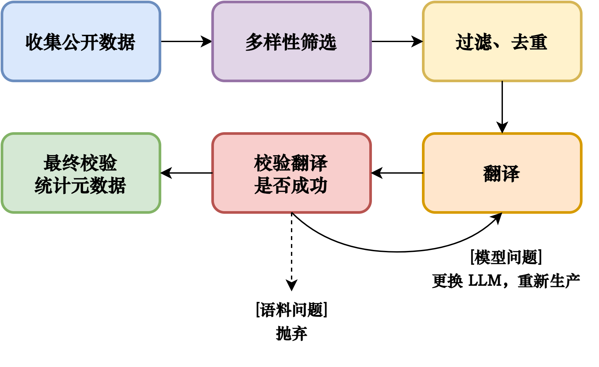

# BiST：大规模中英双语翻译数据集

## 简介

BiST 是一个大型的**中英双语**翻译数据集，BiST 意即 **Bi**lingual **S**ynthetic **T**ranslation dataset。目前数据集总数约为 57M，未来将会继续施工扩充，包括换用更强的 LLM、增加更丰富的语料源等。

相较于 WMT 等经典翻译数据集，BiST 提供了更长的平均翻译长度、更少的噪声、更多样的翻译主题。当然，BiST 并不具备 WMT 的多语种翻译、强人工评估等特点。

数据地址：https://huggingface.co/datasets/Mxode/BiST

## 数据详情

BiST 由两个子集组成，分别为 `en-zh` 和 `zh-en`，其中前者代表源语言，这一部分采集自公开数据，为真实语料；后者代表翻译的目标语言，由多个 LLM 翻译、校验、清洗得到，为合成语料。

在数据集中，每行的字段如下：

- `text_zh`：中文语句，在 `en-zh` 子集中为 LLM 生成的翻译，在 `zh-en` 子集中为真实语料
- `text_en`：英文语句，在 `en-zh` 子集中为真实语料，在 `zh-en` 子集中为 LLM 生成的翻译
- `length_zh`：中文语句的长度，单位为 token，具体取决于本条翻译模型的 tokenizer
- `length_en`：英文语句的长度，单位为 token，具体取决于本条翻译模型的 tokenizer
- `model`：本条翻译模型的名称

推荐根据对应任务使用相应的子集，因为混用会放大合成数据带来的噪声。

## 数据示例

下面展示一些数据示例，更多的可以到 [Hugging Face 上](https://huggingface.co/datasets/Mxode/BiST)查看。

**英译中**

英文（真实语料）：Although plants are renewable resources, there is still a need to find more alternative renewable sources of energy to meet our population’s energy demands. The microbial world is one of the largest resources for genes that encode new enzymes and produce new organic compounds, and it remains largely untapped. This vast genetic resource holds the potential to provide new sources of biofuels ().

中文（翻译结果）：尽管植物是可再生的资源，但我们仍需寻找更多的替代可再生能源以满足我们人口的能源需求。微生物界是编码新酶和产生新有机化合物的基因的最大资源之一，并且尚未得到充分利用。这个庞大的遗传资源有可能提供新的生物燃料来源。

**中译英**

中文（真实语料）：打好基础,首先必须重视数学基本概念,基本定理(公式,法则)的复习,在理解上下功夫,整体把握数学知识.这部分内容的复习要做到,不打开课本,能选择适当途径将它们一一回忆出来,它们之间的脉络框图,能在自己大脑中勾画出来.如函数可以利用框图的形式由粗到细进行回忆.

英文（翻译结果）：To lay a solid foundation, it is first necessary to place a high value on reviewing the basic concepts and fundamental theorems (formulas, laws) of mathematics. Effort should be made to understand these concepts and grasp the overall structure of mathematical knowledge. When reviewing this material, one should be able to recall them by choosing appropriate paths without opening a textbook, and be able to sketch the interconnections and framework of these concepts in one's own mind. For example, functions can be recalled in a step-by-step manner, starting from the general to the specific, using a diagrammatic form.

## 数据实验

在小规模模型（2M~102M）上做了实验，可以发现 BiST 对于小规模翻译模型的从头训练效果还是不错的。

下面是实验模型的细节，所有模型均收录于 [NanoTranslator Collection](https://huggingface.co/collections/Mxode/nanotranslator-66e1de2ba352e926ae865bd2) 中。

|                                                          |  P.  | Arch. |  Act.  |  V.  |  H.  |  I.  |  L.  | A.H. | K.H. | Tie  |
| :------------------------------------------------------: | :--: | :---: | :----: | :--: | :--: | :--: | :--: | :--: | :--: | :--: |
| [XXL2](https://huggingface.co/Mxode/NanoTranslator-XXL2) | 102  | LLaMA | SwiGLU | 16K  | 1120 | 3072 |  6   |  16  |  8   | True |
|  [XXL](https://huggingface.co/Mxode/NanoTranslator-XXL)  | 100  | LLaMA | SwiGLU | 16K  | 768  | 4096 |  8   |  24  |  8   | True |
|   [XL](https://huggingface.co/Mxode/NanoTranslator-XL)   |  78  | LLaMA | GeGLU  | 16K  | 768  | 4096 |  6   |  24  |  8   | True |
|    [L](https://huggingface.co/Mxode/NanoTranslator-L)    |  49  | LLaMA | GeGLU  | 16K  | 512  | 2816 |  8   |  16  |  8   | True |
|   [M2](https://huggingface.co/Mxode/NanoTranslator-M2)   |  22  | Qwen2 | GeGLU  |  4K  | 432  | 2304 |  6   |  24  |  8   | True |
|    [M](https://huggingface.co/Mxode/NanoTranslator-M)    |  22  | LLaMA | SwiGLU |  8K  | 256  | 1408 |  16  |  16  |  4   | True |
|    [S](https://huggingface.co/Mxode/NanoTranslator-S)    |  9   | LLaMA | SwiGLU |  4K  | 168  | 896  |  16  |  12  |  4   | True |
|   [XS](https://huggingface.co/Mxode/NanoTranslator-XS)   |  2   | LLaMA | SwiGLU |  2K  |  96  | 512  |  12  |  12  |  4   | True |

- **P.** - Parameters (in million)
- **V.** - vocab size
- **H.** - hidden size
- **I.** - intermediate size
- **L.** - num layers
- **A.H.** - num attention heads
- **K.H.** - num kv heads
- **Tie** - tie word embeddings

下面展示一些英译中的翻译示例，选取内容均为 BiST 的 dev 集，未参与模型训练：

> 英文原文：The researcher touched upon quite a hot topic in the article – the estimation of the number of victims of the Great Depression in the USA. The material presented in the article apparently made Wikipedia’s moderators delete the piece from the database of the online encyclopedia.
>
> BiST 中文（参考）：研究人员在文章中触及了一个相当热门的话题——美国大萧条中受害者的估计数字。文章中提供的材料显然使得维基百科的编辑删除了该文章从在线百科全书的数据库中。

opus-mt-en-zh 翻译：研究者在文章中触及了一个非常热门的话题 — — 美国大萧条受害者人数估计。 文章中提供的材料显然让维基百科主持人从在线百科全书数据库中删除了这篇文章。

NanoTranslator-XXL2 翻译：研究人员在文章中触及了一个相当热门的话题——美国大萧条受害者人数估计。文章中呈现的材料显然使维基百科的管理员从在线百科全书数据库中删除该内容。

> 英文原文：During a trip to Europe, Barton encountered the International Committee of the Red Cross, and was motivated to create a branch back in America. In 1873, Barton began the American Red Cross, dedicated to helping disaster victims. She served as the organizations first president.
>
> BiST 中文（参考）：在欧洲之行中，巴顿邂逅了红十字国际委员会，这促使她在回国后创办了美国红十字会，致力于帮助灾民。她担任了该组织的首任主席。

opus-mt-en-zh 翻译：1873年,巴顿开始成立美国红十字会,致力于帮助灾民。 她担任了该组织的第一任主席。

NanoTranslator-XXL2 翻译：在欧洲之旅中，巴顿遇到了红十字国际委员会，并被激发去美国创建分支机构。1873年，巴顿开始了美国红十字会的活动，致力于帮助灾民。她担任了组织的第一任主席。

如果你也想实际体验一下模型效果，除了直接部署上面的模型，也可以到 [Demo 这里](https://huggingface.co/spaces/Mxode/NanoTranslator-Demo)试玩一下。

## 构建细节

下图简要展示了 BiST 的构建流程。

- 收集公开数据：这一步收集了大量的真实世界语料
- 多样性筛选：为了保证最终构建的翻译数据集更贴近各类真实翻译需求，这一步需要对收集的真实世界语料进行多样性筛选，尽量覆盖不同的领域
- 过滤、去重：这一步主要采用了前缀去重、MinHash 去重、关键词过滤、启发式规则过滤等方法，这一步会过滤掉非中英的语料
- 翻译：调用 LLM 进行翻译，这一步采用的 LLM 有：
    - Qwen2-7B-Instruct
    - glm-4-9b-chat
    - Yi-1.5-9B-Chat-16K
    - internlm2_5-7b-chat
    - Qwen1.5-7B-Chat
    - chatglm3-6b
    - Yi-1.5-6B-Chat
    - Qwen2-1.5B-Instruct
    - ERNIE-Speed-128K
    - ERNIE-Speed-8K
    - ERNIE-Lite-8K
    - ERNIE-Tiny-8K
    - Spark-Lite
- 校验翻译是否成功：如果失败，会进行如下分类：
    - 语料问题：可能是语料本身就不适合翻译，例如纯代码行、纯数学表达式等等，那么抛弃掉这一部分
    - 模型问题：可能是模型本身的生成问题，则将语料重新加入待翻译队列中，并选取另外的 LLM 进行翻译。此处会设置最大重试次数，超过后也将抛弃
- 最终校验，统计元数据：对所有生成的数据进行最后的校验和整合

## 局限性

BiST 是一个合成数据集，它的核心价值在于开放性、包容性和助人精神。它旨在服务于所有人，并适用于广泛的应用场景。请注意，尽管 BiST 尽力进行了过滤，但仍然难以保证最终内容是完全准确、无偏见的。因此，在使用 BiST 前应当根据使用场景进行更加详尽的选择和过滤。