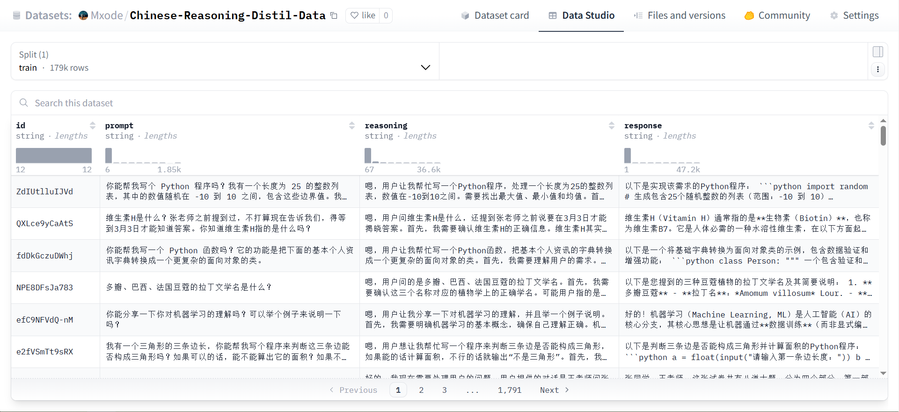
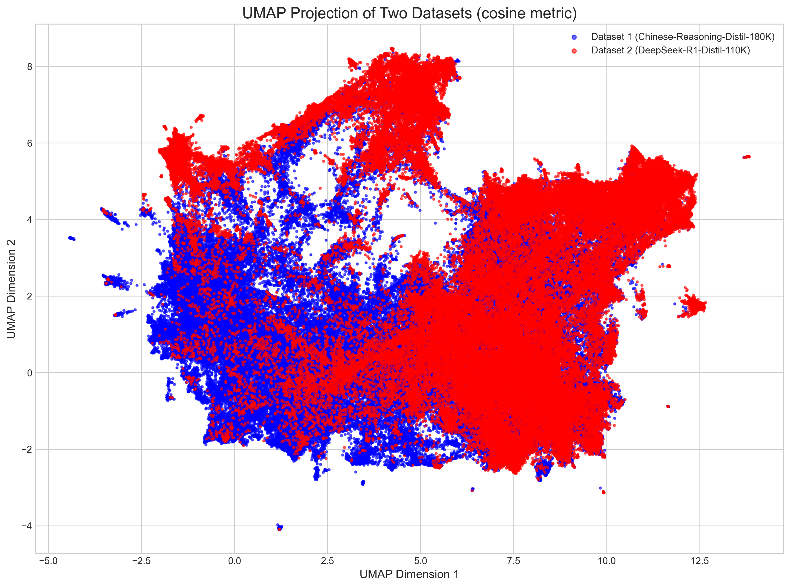

# 中文推理蒸馏数据集：Chinese-Reasoning-Distil-Data

## 简介

现有的中文推理蒸馏数据集质量比较好的应该就是 [Congliu/Chinese-DeepSeek-R1-Distill-data-110k](https://huggingface.co/datasets/Congliu/Chinese-DeepSeek-R1-Distill-data-110k) 了。目前社区里英文的各种推理数据集层出不穷，但好像一直没有更多的中文推理数据集了，于是这里贡献一个。

相比于 [Chinese-DeepSeek-R1-Distill-data-110k](https://huggingface.co/datasets/Congliu/Chinese-DeepSeek-R1-Distill-data-110k)，本数据集有如下简要特点：

- 数据集数目更多，总量 180K
- 指令来源不同，增加指令的多样性
- 非现有社区英文推理数据集的翻译版本，原生中文回复
- 模型回复源更多样，除 DeepSeek-R1-671B 以外，还引入了 QwQ-32B 和 GLM-Z1-32B，使得回复采样的丰富度更高。当然，这里还是默认 DeepSeek-R1-671B 的回复质量更好，后面引入了分数阶梯回复的采样策略。

数据集地址：[Mxode/Chinese-Reasoning-Distil-Data](https://huggingface.co/datasets/Mxode/Chinese-Reasoning-Distil-Data)

更多我自建的有意思的数据集，欢迎关注我的 Github Repo：[Maxs-Awesome-Datasets](https://github.com/Mxoder/Maxs-Awesome-Datasets)

## 数据详情

数据格式就是很常见的 reasoning 数据集的格式，包括：

- `id`：12 位 nanoid，用于区分数据
- `prompt`：输入提示词
- `reasoning`：模型思考过程
- `response`：模型最终回复

下面提供了本数据集与 [Chinese-DeepSeek-R1-Distill-data-110k](https://huggingface.co/datasets/Congliu/Chinese-DeepSeek-R1-Distill-data-110k) 的指令语义降维可视化比较：

可以看到，二者的语义在右侧有相当一部分区域是重叠的，这可能覆盖了许多共同的主题、问题类型、推理模式或语言风格；但在左侧，Chinese-Reasoning-Distil-Data 具备一些独特的指令语义，说明其还是能够为社区补充额外的中文推理语料的。

（PS：这里右侧重叠的一部分只是语义相似，不代表指令是一样的，本数据集的指令采样来源是不同的来源）

## 构造细节

其实构造一个中文推理蒸馏数据集，最简单、效果也不错的方式就是直接用 DeepSeek-R1-671B 跑指令然后筛选。但是一方面确实要考虑成本（特别是个人开源），另一方面也是希望增加采样的丰富度。最终，考虑到效果和成本的平衡，本数据集采用了如下模型生成回复：

- DeepSeek-R1-671B
- QwQ-32B
- GLM-Z1-32B-0414

不过一般仍然认为 DeepSeek-R1 是综合效果更好的那一个，因此，这里采用一个打分阶梯回复的策略。具体来说，先用模型对指令进行评分，然后根据分数阶梯，配置好三个模型的采样频率。DeepSeek-R1 在高分段的采样比重会比在低分段采样比重更高，而另外两个模型则共享相同的采样频率。

至于打分，出于成本考虑没有用更大的模型，主要用 Qwen2.5-7B 和 GLM4-9B 两个模型。打分评价的维度主要是指令的复杂度。在对指令池内的所有指令打完分以后，剔除了后 30% 的数据，只对前 70% 的指令进行阶梯采样。

## 局限性

Chinese-Reasoning-Distil-Data 是一个合成数据集，它的核心价值在于开放性、包容性和助人精神。它旨在服务于所有人，并适用于广泛的应用场景。请注意，尽管 Chinese-Reasoning-Distil-Data 尽力进行了过滤，但仍然难以保证最终内容是完全准确、无偏见的。因此，在使用 Chinese-Reasoning-Distil-Data 前应当根据使用场景进行更加详尽的选择和过滤。
