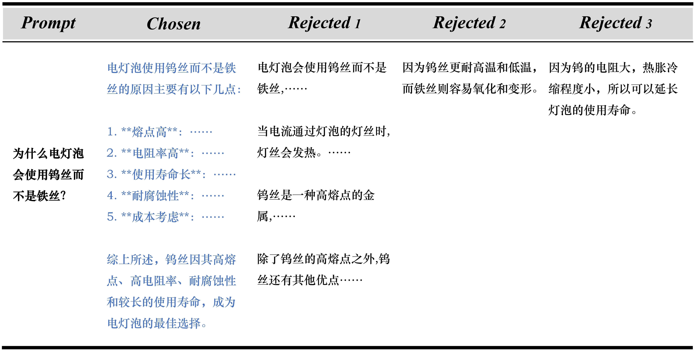
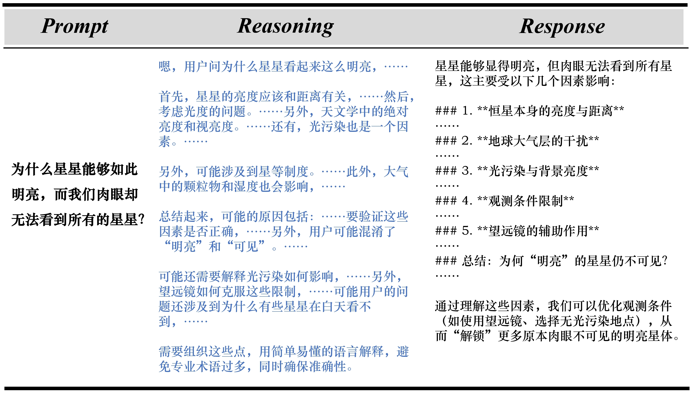

# 可能是最适合用于学习从零训练中文大模型的数据集！

## 前言

在我刚入门 LLM 的时候，喜当调包侠，跑了几次 LoRA、微调了几个模型，又看了几篇不知云雾的论文，这时我总是忍不住想：我要是能自己从零训练一个大模型——特别要是中文大模型——就好了！从那时起，我就一直在思考和关注这类从零训练 LLM 的项目。幸运的是，目前社区里已经有不少关于从零训练 LLM 的项目（以下简称 LLM from scratch 类项目），其中也有很优秀的从零训练中文 LLM 的 Repo，例如已经斩获 20k+ stars 的 [MiniMind](https://github.com/jingyaogong/minimind)。

不过根据我的观察，这类项目更加关注训练流程本身（当然是无可厚非的），使用的数据集基本都是收集自社区中已有的开源中文数据集。但俗话说得好，LLM 训练中其实一个非常关键但又容易被忽略的环节，就是**数据**的选择。事实上，目前的 LLM from scratch 项目所使用的数据集其实是存在着一些问题的，例如：

- **噪声严重**：数据中常常混杂着很多噪声，包括但不限于事实错误、格式错误、内容空缺、语言混杂等等。
- **质量较低**：例如 MiniMind 中使用的 [匠数数据集](https://www.modelscope.cn/datasets/deepctrl/deepctrl-sft-data)，这是一个组合性的中文指令数据集，里面包含了很早期的一些合成数据集，现在的眼光看来是质量较低的，例如：BELLE、TigerResearch、moss-003。熟悉的读者可能了解，这些数据集是非常早期的中文数据集探索工作，它们当时的确有着开拓性的贡献，但如今看来其质量确实难尽如人意。
- **领域偏移过大**：这个其实不算缺陷，因为对于 LLM 的训练而言，当然希望涉及的数据尽可能范围广。不过当前语境是讨论从零训练一个**小型的** LLM（一般不超过 0.5B，更多时候不超过 0.1B），数据领域如果涉及过广、偏移过大，小型 LLM 其实是很难收敛或者很难训练出好的效果的。
- **质量方差过大**：这个涉及到数据混合的问题，仍然以 MiniMind 为例，其在 SFT 阶段还额外引入了一个英文高质量数据集 Magpie，和上一条类似，我们很难期望迷你型 LLM 有自涌现能力，加入跨语言的高质量数据其实是难以有显性增益、甚至有负面影响的。

如此种种，我便萌生了构造一个**更适合于学习性质的中文 LLM 数据集**的想法。目前可以大致分为 4 类数据：(1) 预训练数据集；(2) SFT 的指令数据集；(3) 强化学习的偏好数据集；(4) 近来很火的 reasoning 推理数据集。在详细搜索社区已有数据集后，我发现预训练数据集还是有很多优秀中文数据集可用的，如 [IndustryCorpus](https://huggingface.co/datasets/BAAI/IndustryCorpus2)、[Fineweb-Edu-Chinese](https://huggingface.co/datasets/opencsg/Fineweb-Edu-Chinese-V2.1) 等。本着不重复造轮子的理念，我于是只计划构造后 3 类数据。

终于，经过精心的设计构造，这里介绍**可能是目前最适合用于学习从零训练中文大模型的数据集：** I_Wonder_Why-Chinese，即，十万个为什么 - 中文百科开放问答数据集。这个数据集具备如下特点：

- **数据量丰富**：包含指令数据集、偏好数据集、推理数据集三大部分，共计超过 60 万条指令和超过 300 万条回复数据。这意味着，如果你想尝试从零学习训练一个中文 LLM，你不需要担心如何找不同阶段的数据和如何清洗数据，本数据集可以一站式解决。
- **数据广、难度适中**：对于一个学习性质的迷你规模的 LLM，你大概率是期待能够训出一个流畅回复的 LLM，而不是一味追求 sota。因此广、难度适中的数据集就非常有必要了，这既能够让 LLM 学到充分的知识，又不至于因为复杂度过大导致难以收敛。
- **数据长度适中、分布均匀**：这个问题其实有时候也容易被忽略，就是训练数据本身长度是否适宜。对于迷你模型而言，适中偏短的数据长度更易于收敛，并且更能降低学习复现的成本（`seq_len` 才是占显存的大头）。而均匀的数据长度分布既便于朴素实现，也能降低 packing 的影响。
- **开放式问答**：之所以特意选择构造十万个为什么这样百科科普性质的问答数据集，是因为这样的数据没有一个固定的 golden answer，降低了迷你模型学习的难度，并且易于泛化，更容易实现能力迁移，最后训出来的效果会更好。
- **有保证的质量**：本数据集经过精心设计构造和二次清洗，不会出现语言混杂、内容空缺等质量问题，这对于迷你模型的学习也更轻松和更有帮助。

具体详情让我们放到正文中介绍，这里先给出数据集地址：[Mxode/I_Wonder_Why-Chinese](https://huggingface.co/datasets/Mxode/I_Wonder_Why-Chinese)

更多我自建的有意思的数据集，欢迎关注我的 Github Repo：[Maxs-Awesome-Datasets](https://github.com/Mxoder/Maxs-Awesome-Datasets)

## 数据详情

I_Wonder_Why-Chinese 数据集是一个中文百科问答数据集，就像它的名字那样，“十万个为什么”（I Wonder Why），它的每条指令都是简短的百科知识提问，例如：`为什么海拔越高，温度越低？`、`为什么猫咪有夜晚视力？`、` 为什么有些鱼类的眼睛长在头的两侧？`。这些问题就像我们小时候看的十万个为什么一样，简短、开放，并且回复可精简可详细。

具体来说，I_Wonder_Why-Chinese 数据集分为三个子集：

- `general`：用于 SFT 的指令微调数据集，数据量 600K+。
- `preference`：用于强化学习的偏好数据集，即可用于 DPO、ORPO、SimPO 等训练，指令 600K+，每条指令包含 1 条 chosen  回复和 3 条 rejected 回复，这意味着可以构造 3 倍量的 pairwise 偏好数据集。
- `reasoning`：目前新热的推理数据集，遵循 o1、R1 类格式，包含指令、思考过程、最终回复，数据量也是 600K+。

事实上，这里的三个子集的指令是完全一致的，每条指令都有独一无二的 `id` 作为区分，这意味着你可以轻松地混搭数据，例如利用 `reasoning` 和 `general` 来构造偏好数据也完全没问题。

下面让我们来具体看看数据示例。

### SFT 指令数据集

这是最标准的指令数据集，格式为 `id-prompt-response`，例如：

> 问题：
>
> 为什么水果的成熟时间各不相同？

回答：

水果的成熟时间各不相同，主要是由以下几个因素决定的：

1. **品种差异**：不同品种的水果在遗传上就存在差异，这决定了它们的生长周期和成熟时间。例如，香蕉和苹果的成熟时间就相差很大。 
2. **气候条件**：温度、光照、降雨量等气候条件对水果的成熟有显著影响。热带水果如芒果和菠萝通常在温暖湿润的气候下生长，成熟较快；而温带水果如苹果和樱桃则需要较冷和较短的日照时间。
3. **生长环境**：土壤质量、水分供应和养分状况也会影响水果的成熟时间。良好的土壤和充足的水分可以促进水果更快成熟，而贫瘠的土壤和水分不足则会使成熟过程延长。
4. **植物激素**：植物自身会分泌一些激素，如乙烯，来调节成熟过程。乙烯的释放可以加速水果的成熟和软化。不同水果乙烯的释放时间和量不同，这也导致了它们成熟时间的差异。
5. **种植技术**：农业技术如疏花疏果、施肥和灌溉管理等，也会影响水果的成熟时间。合理的管理可以促进水果均匀成熟。 这些因素综合作用，使得不同水果在自然和人工条件下表现出不同的成熟时间。

这里的每条问题都是一道类似于“十万个为什么”的百科问答题，而答案都是长度适中的一些开放式解答，没有一个绝对的固定答案。

### 偏好数据集

偏好数据集的指令与 SFT 数据集完全一致，都是百科类开放问答，两个数据集之间的指令可以通过 `id` 一一对应。而在回复方面，偏好数据集中 `response` 变为了 `chosen`，并且额外多了 3 条 `rejected` 的回复。这三条任意抽出一条都可以和 `chosen` 构建偏好对，当然也可以 3 条都用上，构建 3 对偏好对。

不过需要注意的是，3 条 `rejected` 回复内部本身是没有偏好序的，它们 3 条之间不能交叉构造偏好对。

### 推理数据集

目前社区其实是很缺乏中文推理数据集的（再次给我的专栏和我的 Github Repo 打广告，里面有提供不少新的推理数据集），更不用说适合于学习复现性质的中文推理数据集了。

但是！我们的 `I_Wonder_Why-Chinese` 数据集还是不负期望，同样地给出了推理数据集，并且指令仍然和前面一一对应，这意味着这里的推理数据子集的数量达到了 **600K+**。

这里格式是很常见的 `id-prompt-reasoning-response` 格式，同样地，指令也是可以通过 `id` 和前两个数据集一一对应。这意味着你可以非常方便地交叉构造新的数据集，例如和 SFT 数据集结合构造新的偏好数据集。

## 局限性

I_Wonder_Why-Chinese 是一个合成数据集，它的核心价值在于开放性、包容性和助人精神。它旨在服务于所有人，并适用于广泛的应用场景。请注意，尽管 I_Wonder_Why-Chinese 尽力进行了过滤，但仍然难以保证最终内容是完全准确、无偏见的。因此，在使用 I_Wonder_Why-Chinese 前应当根据使用场景进行更加详尽的选择和过滤。

## PS

如同开头所说，这个数据集是带着目的构造的（方便学习性复现），因此也意味着它的难度是有上限的，**非常不推荐将这个数据集用于超过 7~8B 规模的模型的训练**。我觉得它用于 < 2B 的模型、用在学习性复现的 LLM from scratch 项目是非常合适的。

如果你问：我确实想要更高质量、更大规模的中文指令数据集，有吗？有的朋友，有的。在我的 Github Repo [Maxs-Awesome-Datasets](https://github.com/Mxoder/Maxs-Awesome-Datasets) 里，还有不少更高质量的数据集，例如：

**Chinese-Instruct**

- 简介：大规模中文指令微调数据集，相较于已有的中文指令微调数据集，具备更高的质量、更多指令来源、更大的规模。

- 规模：4.5M+

- 链接：https://huggingface.co/datasets/Mxode/Chinese-Instruct

**Chinese-Reasoning-Distil-Data**

- 简介：中文推理蒸馏数据集，包含指令、思考过程、回复，全新构造，非其他数据集的子集或翻译版本。

- 规模：180K

- 详情：[知乎文章 - 新的中文推理蒸馏数据集：Chinese-Reasoning-Distil-Data](https://zhuanlan.zhihu.com/p/1898405616860521535)

- 链接：https://huggingface.co/datasets/Mxode/Chinese-Reasoning-Distil-Data

如果你觉得这个数据集有帮助，欢迎 star 我的仓库关注并鼓励我！